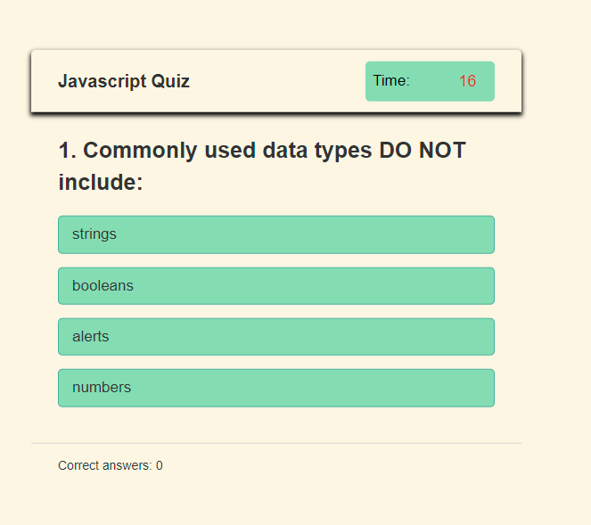

# Javascript Quiz project

## Description

The instructor (aka. client) requested a javascript quiz.

Published at: https://corhydare.github.io/quizzingexamination/

Following instructions were given:

```
GIVEN I am taking a code quiz
WHEN I click the start button
THEN a timer starts and I am presented with a question
WHEN I answer a question
THEN I am presented with another question
WHEN I answer a question incorrectly
THEN time is subtracted from the clock
WHEN all questions are answered or the timer reaches 0
THEN the game is over
WHEN the game is over
THEN I can save my initials and my score
```

### list of questions was in a separate .js file:

```javascript
let questions = [
  {
    qc: 1,
    title: "Commonly used data types DO NOT include:",
    choices: ["strings", "booleans", "alerts", "numbers"],
    answer: "alerts",
  },
```

### Saving high scores in local storage turned out to be the easiest part

```javascript
if (userScore > window.localStorage.getItem("Score")) {
    const finalName = prompt("Enter your name to save your score", "Player 1");

    window.localStorage.setItem("Player", finalName);
    window.localStorage.setItem("Score", userScore);

    document.getElementById("p1").innerHTML =
      "<span>" +
      window.localStorage.getItem("Player") +
      "</span> scored <span>" +
      window.localStorage.getItem("Score") +
      " points.</span>";
  }
```

## Prompts

In order to keep the quiz clean within a single page there was a need for temproray element removal:

### add one "window" and remove another

```javascript
  qFrame.classList.add("activeQuiz");
  finalDiv.classList.remove("activeResult");
```

### Timer only ran during the quiz:

```javascript
function countdown(time) {
  counter = setInterval(timer, 1000);
  function timer() {
    timeCount.textContent = time;
    time--;
    if (time < 0) {
      clearInterval(counter);
      showResult();
    }
  }
}
```

### questions.js file was indexed and separated for insertion:

```javascript
function countdown(time) {
  counter = setInterval(timer, 1000);
  function timer() {
    timeCount.textContent = time;
    time--;
    if (time < 0) {
      clearInterval(counter);
      showResult();
    }
  }
}
```
## App



## Conclusion

With this section it was neccesary to review a lot of course work, as class time did not adequately prepare me for this project.
Nevertheless the final product was pleasing, especially since I understood how I got there.
